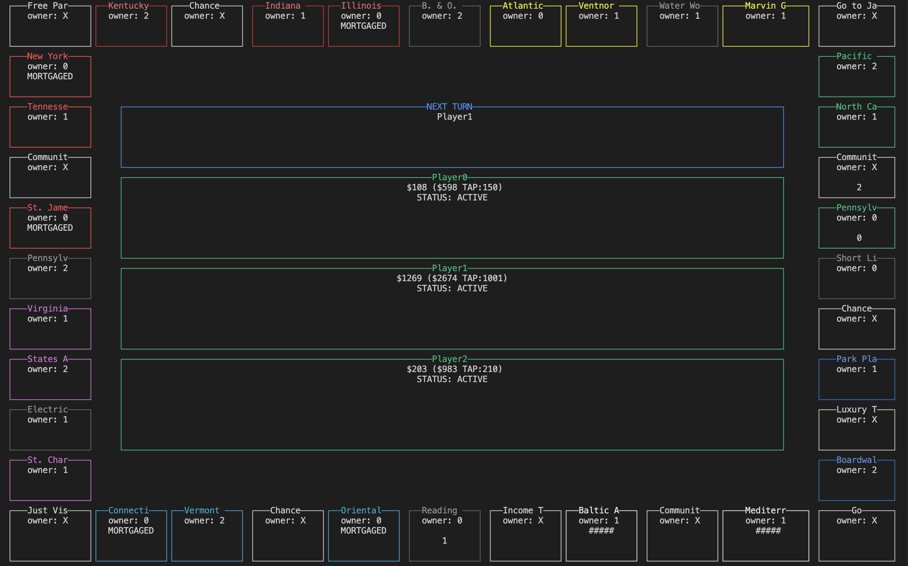

# Monopolizer

A collection of tools for simulating or analyzing Monopoly game.

<p align="center">
    
    <figcaption align="center">
        Fig. `mplzc` in visual mode
    </figcaption>
</p>

## Components

The project Monopolizer consists of three items:

- mplz (a REST API server for simulating Monopoly game)
- mplzc (a command line tool for simulating Monopoly game)
- mplzlib (a collection of functions or structures for doing Monopoly-related calculations)

`mplz` is a kind of REST API server and is designed to receive and respond to calculation requests from other platforms, such as Jupyter notebook. Since these operations are done through the HTTP protocol, there is no point in using this without HTTP clients. In most cases, using `mplzc` instead is far easier and recommended.

`mplzc` is a command line tool for simulating or analyzing the game. This tool has no fewer abilities of calculations than `mplz` and does not require you to deal with HTTP protocols. This application contains not only interactive mode, but also a visual mode, with which you can view the status of the board graphically.

`mplzlib` is a fundamental library for simulating or inspecting the game. All types of calculations `mplz` or `mplzc` can are implemented in it. If you are not content with `mplz` or `mplzc`, it might be helpful to use this library as one of the dependencies.

If you want to know more about these tools, watching the document of each tool may help you.

## Tutorial

Let's try analyzing the game you played in the real world.

**Jupyter notebook and an environment in which you already install `cargo` are needed.**

### 1. Clone the repository

```
git clone https://github.com/caphosra/monopolizer.git
```

### 2. Generate a JSON file to pass to the program

Launch `mplzc`.
```
cd monopolizer
cargo run --bin=mplz

```

After it launched, initialize a game, save it as a JSON file, and quit `mplzc`.
You should replace `3`, found in the following example, with the number of people playing.
```
$ init 3
$ save ./board.json
$ exit
```

### 3, Edit the JSON file

Open the JSON file and edit the information to reproduce the game.

### 4. Preview the JSON file

This step is not necessary.

To ensure the JSON file is valid, try opening the file by `mplzc` and previewing it.
```
cargo run --bin=mplz
$ load ./board.json
$ vmode
```

After checking it, press `q` to quit the visual mode and type:
```
$ exit
```

### 5. Analyze the game

Open `Analysis.ipynb`. Then, edit the second cell (or add a new cell if you want) as follows.
```python
GAME_INFO_FILE = "./board.json" # <-- Changed
RESULT_FILE = str(Path(GAME_INFO_FILE).with_suffix(".analyzed.csv"))
ITERATION = 500
SIMULATE_TURN = 30
PLAYER_NUM = 3 # <-- Changed
```

You can change `ITERATION` and `SIMULATE_TURN` as you want.

Run all of the cells and you'll see the result of analysis of the game.
